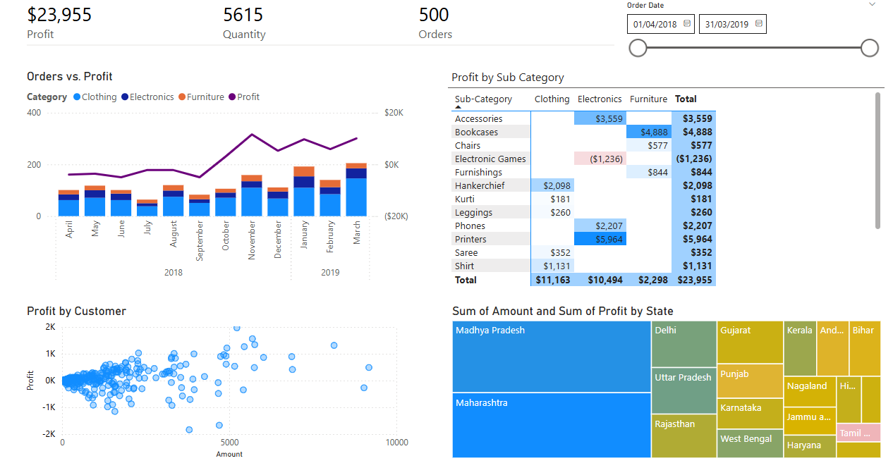

# Product Lines Performance (Power BI)

A compact analytical dashboard for the Head of Finance to identify **low-performing products/regions** and **levers to grow profit**. This repo is wired for a PBIX workflow (with Git LFS) and includes screenshots + docs.

## Files you’ll add (from your local folder)
- `report/e-commerce-analisys.pbix`
- `data/sample/Order Details.csv`
- `data/sample/List of Orders.csv`
- `data/sample/Sales target.csv`

> Keep the **exact file names** or update the queries/parameters in Power BI accordingly.

## Data Story Objectives
| Objective | Users | Actions | Usage Frequency |
|---|---|---|---|
| Review current product lines and identify areas for improvement | Head of Finance | *Identify areas to improve revenue; find low-performing products and regions; track order volume* | Monthly |

## KPIs
| Name | Objective | Definition | Visual | Source |
|---|---|---|---|---|
| **Profit** | Financial driver | Sum of Profit | KPI + Trend + Composition | `Order Details.csv` |
| **Quantity** | Operational volume | Sum of Units | KPI | `Order Details.csv` |
| **Order Volume** | Shipment load | Distinct count of `Order Id` | KPI | `List of Orders.csv` |
| **Sales Target (optional)** | Target tracking | Sum of target by period | Gauge/Comparison | `Sales target.csv` |

## Preview
| Overview | Insights |
|---|---|
|  |  |

## Notes
- Do **not** commit real credentials or connection strings. Use parameters.  
- If you later convert to PBIP, commit the PBIP folder under `/report` and keep PBIX for releases only.

## 📄 License
MIT
